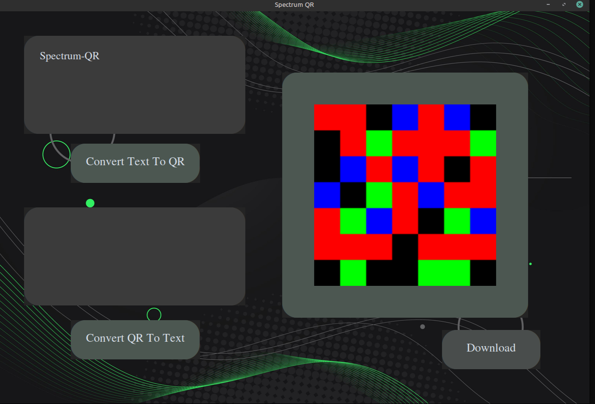

# Spectrum-QR
An experimental color-based QR-like encoding system using multistate RGB modules for higher-density visual data storage.

## Preview

## How It Works

The encoder converts text into UTF-8 bytes, transforms the bytes into binary, splits the binary stream into 2-bit chunks, and maps each chunk to a unique RGB color state.

Pipeline:

Text
→ UTF-8
→ Binary
→ 2-bit chunks
→ Numerical states
→ RGB matrix
→ PNG image
